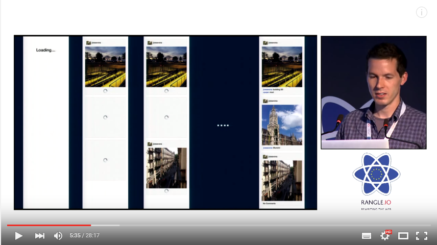

I got inspired by the [great talk](https://youtu.be/IrgHurBjQbg) of [Joseph Savona](https://twitter.com/en_JS) and decided to give a try to GraphQL and Relay.

This is a work in progress and I'm still trying to wrap my head around GraphQL concept as this is pretty new to me.

## Stack:
- React
- Relay
- CSS Modules
- Semantic UI
- KoaJS

## Resources
- [official doc](https://facebook.github.io/relay/docs/getting-started.html#content)
- [todo app example](https://github.com/facebook/relay/tree/master/examples/todo), the simplest example I needed to start with GraphQL/Relay. 
- [auth0 article](https://auth0.com/blog/2015/10/06/getting-started-with-relay/) these guys are awesome. Checkout their [blog](https://auth0.com/blog/)!

## Todo:
- [x] :shipit:
- [x] add KoaJS middleware to upload selfies on Cloudinary before koa-graphql handles request
- [ ] add/remove Like mutation
- [ ] handle server side errors
- [ ] tests
- [ ] host on Heroku
- [ ] page transitions
- [ ] FeedItem's loading animation
